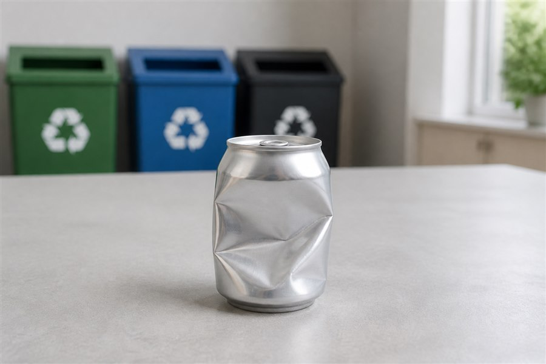
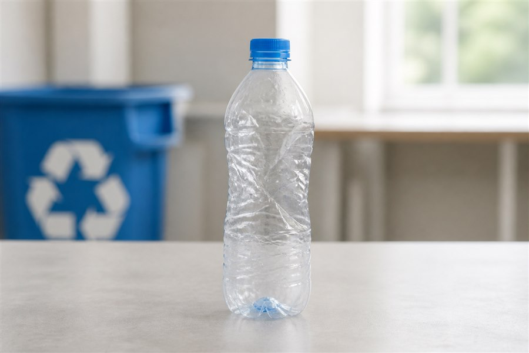
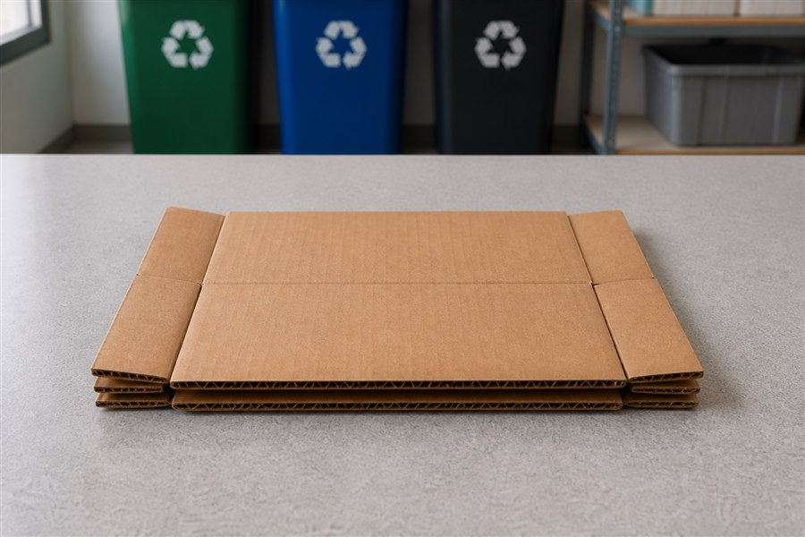
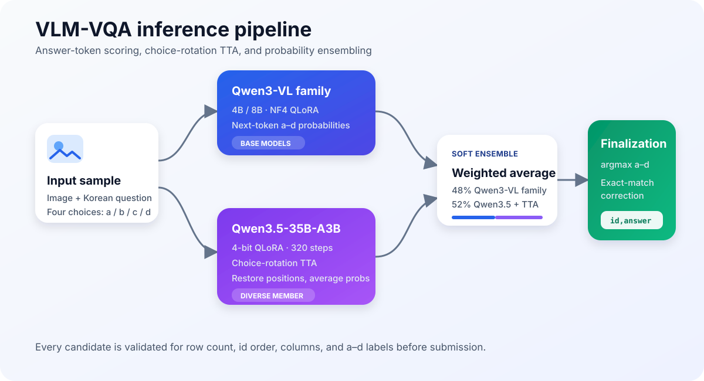
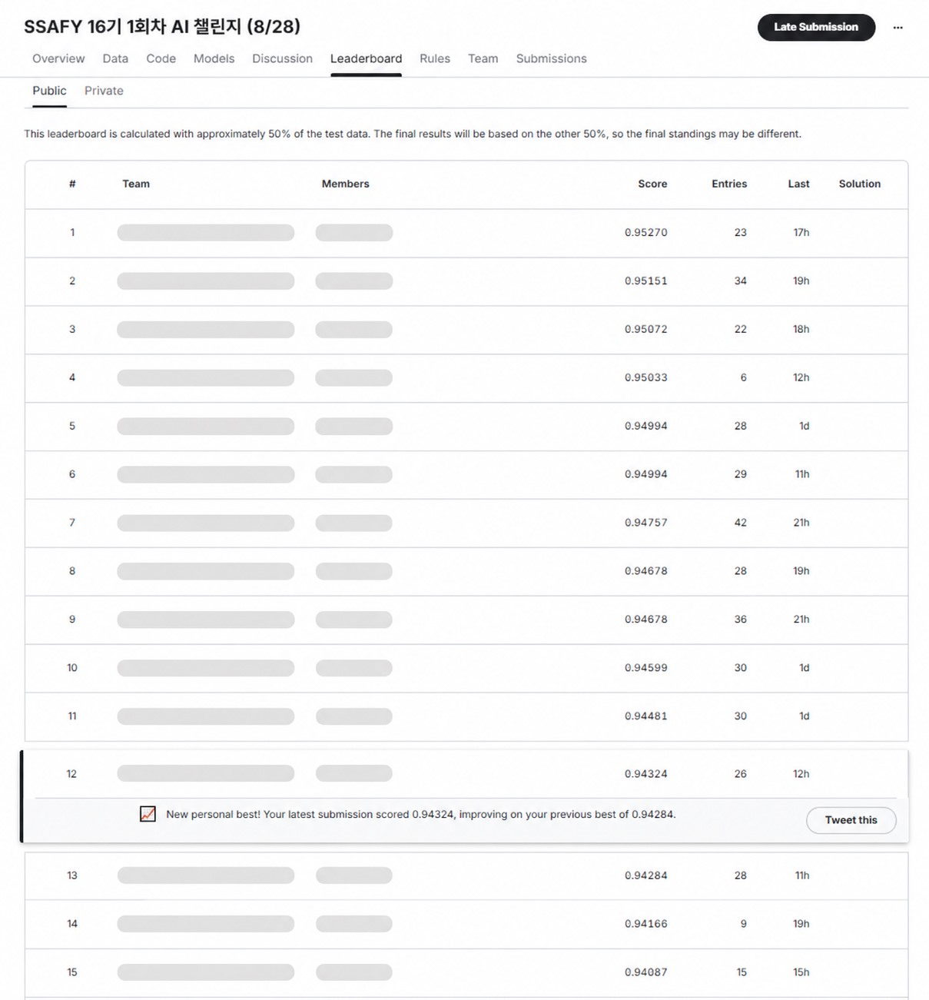
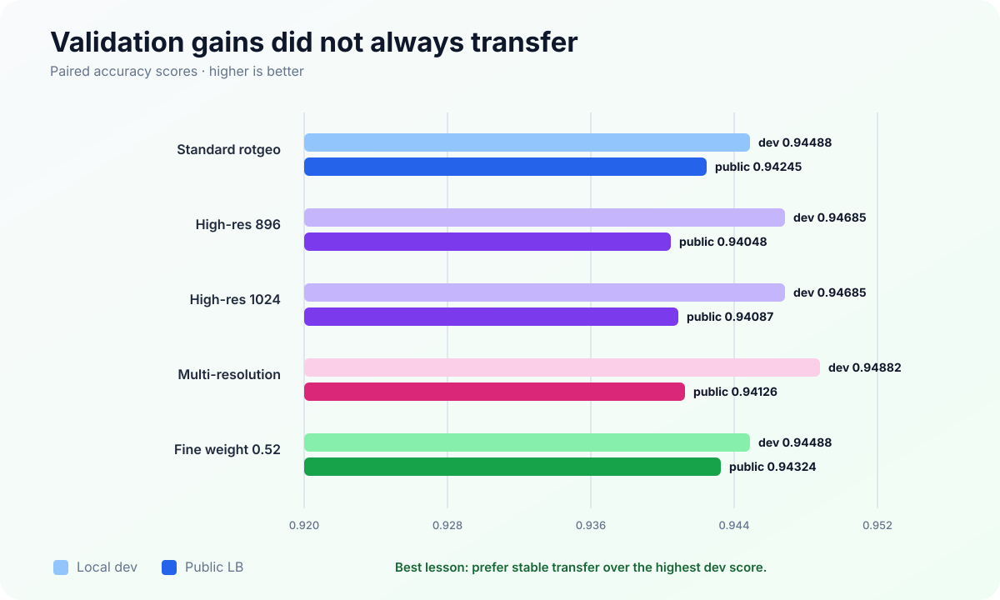

# SSAFY VLM-VQA Pipeline

[한국어](README.md) | **English**

A reproducible pipeline for Korean four-choice Visual Question Answering. Given an image, a question, and choices `a` through `d`, the model returns exactly one answer label.

The project started with Qwen3-VL-4B QLoRA on a local RTX 5060 Ti and was extended to Qwen3.5-35B-A3B on RunPod A100 GPUs, choice-rotation test-time augmentation, and probability ensembling. The Public Leaderboard score improved from **0.92116 to 0.94324**.

> Competition data and derivatives are not published. This repository excludes original images and CSV files, prediction probabilities, submission files, LoRA adapters, and checkpoints. The code can be adapted to datasets with the same `image + question + a/b/c/d` structure.

## Competition at a glance

| Item | Description |
| --- | --- |
| Competition | SSAFY 16th Cohort AI Challenge |
| Goal | build a VQA model for recycling images and Korean questions |
| Task | predict one correct choice from `a` through `d` |
| Metric | Accuracy |
| Submission | CSV with `id,answer` columns |
| Key rules | individual teams; LoRA, quantization, and augmentation allowed; API inference prohibited; 20 submissions per day |

See the [official Kaggle competition](https://www.kaggle.com/competitions/ssafy-16-1-ai) and the repository's [competition overview](docs/COMPETITION.en.md) for the dataset structure, evaluation, and implementation-relevant rules.

## Example questions

> These are **synthetic images** created only to demonstrate the task format. They are not part of the private competition dataset.

<table>
  <tr>
    <td width="33%"></td>
    <td width="33%"></td>
    <td width="33%"></td>
  </tr>
  <tr>
    <td><strong>What is the main material of the recyclable item?</strong><br>a. glass<br>b. metal<br>c. paper<br>d. vinyl<br><strong>Answer: b</strong></td>
    <td><strong>Which container is most prominent?</strong><br>a. plastic bottle<br>b. paper cup<br>c. glass bottle<br>d. metal can<br><strong>Answer: a</strong></td>
    <td><strong>What is the folded packaging material?</strong><br>a. vinyl<br>b. cardboard box<br>c. glass bottle<br>d. metal can<br><strong>Answer: b</strong></td>
  </tr>
</table>

The model must jointly compare the **visual evidence, the intent of the Korean question, and the meaning of all four choices** rather than classifying the image alone.


## Pipeline at a glance



“Combining models” here does not mean merging checkpoints. Each model produces probabilities for `a`, `b`, `c`, and `d`; those probabilities are weighted and averaged before selecting the largest value. This is a **soft ensemble**.

## Results

| Stage | Main change | Public LB |
| --- | --- | ---: |
| Pipeline smoke test | Qwen3-VL-4B, 180 training samples | 0.85777 |
| Local baseline | Qwen3-VL-4B QLoRA, full train split | 0.92116 |
| A100 baseline | Qwen3-VL-8B | 0.92353 |
| Qwen3.5 candidate | 35B-A3B QLoRA + rotation TTA + soft ensemble | 0.94245 |
| 896px / 1024px TTA | high-resolution inference | 0.94048 / 0.94087 |
| Final tuning | Qwen3.5 weight `0.50 → 0.52` | **0.94324** |

### Public Leaderboard



The final candidate placed **12th out of 955 participants on the Public Leaderboard (top 1.3%)**. Team names, personal names, and profile images—including the author's—are redacted in the screenshot. The Public board used approximately 50% of the test set, so the final Private ranking may differ.

The high-resolution ensemble reached up to 0.94882 on the local development split but performed worse on the Public Leaderboard. This repository therefore documents unsuccessful experiments and validation overfitting, not just the final recipe.

See [the full English experiment log](docs/EXPERIMENT_LOG.en.md) or [the original Korean log](docs/EXPERIMENT_LOG.ko.md) for the complete timeline.

## Key ideas

### 1. Supervise only the answer token

Image, question, choices, and prompt tokens are masked with `-100`. Loss is computed only for the assistant's one-letter answer. This aligns training directly with the multiple-choice objective.

### 2. Score choice logits instead of generating text

The pipeline reads the next-token logits for `a`, `b`, `c`, and `d`, avoiding long-form generation and parsing failures while preserving probabilities for ensembling.

```python
choice_logits = next_logits.index_select(-1, choice_token_ids)
probabilities = choice_logits.float().softmax(dim=-1)
prediction = "abcd"[probabilities.argmax().item()]
```

For batched inference, the tokenizer must use left padding when reading `logits[:, -1, :]`. With right padding, shorter samples may read logits from a padding position.

### 3. Choice-rotation TTA

The choices are cyclically rotated and evaluated several times. Each probability vector is mapped back to the original choice positions before averaging, reducing positional bias.

### 4. Probability ensemble

Choice probabilities from the Qwen3-VL and Qwen3.5 families are mixed. The best public candidate used approximately 48% Qwen3-VL-family probability and 52% Qwen3.5 probability.

### 5. Grouped validation

Byte-identical images are kept in the same split using SHA-256 image groups. This prevents duplicate images from leaking across training and validation.

### 6. Optional exact retrieval

When a provided training image and question exactly match a test sample and the answer text maps unambiguously to one test choice, a deterministic override can be applied. Always verify that the competition rules permit this use of the provided training data.

## Repository structure

```text
.
├─ README.md / README.en.md
├─ docs/
│  ├─ EXPERIMENT_LOG.ko.md / EXPERIMENT_LOG.en.md
│  ├─ COMPETITION.ko.md / COMPETITION.en.md
│  ├─ METHODS.ko.md / METHODS.en.md
│  ├─ SUBMISSION_RETROSPECTIVE.ko.md
│  └─ assets/
│     ├─ public-score-chart.png
│     ├─ public-leaderboard-anonymized.jpg
│     ├─ pipeline-architecture.svg
│     ├─ validation-vs-public.svg
│     └─ examples/ (synthetic VQA samples)
└─ workspace/
   ├─ configs/       # Qwen3-VL and Qwen3.5 experiment configs
   ├─ src/           # data audit, training, inference, evaluation
   ├─ runpod/        # rotation, ensemble, calibration, validation tools
   └─ requirements.txt
```

## Expected data format

```text
train.csv: id,path,question,a,b,c,d,answer
test.csv:  id,path,question,a,b,c,d
sample_submission.csv: id,answer
train/, test/: images referenced by the CSV path column
```

Pseudo-labels from a development CSV should be kept separate from ground-truth validation labels.

## Quick start

Python 3.10–3.12 and a CUDA GPU are recommended. Install a CUDA-compatible PyTorch build first.

```bash
python -m venv .venv
source .venv/bin/activate
pip install -r workspace/requirements.txt
```

On Windows PowerShell, activate the environment with `.venv\Scripts\Activate.ps1`.

### Prepare grouped splits

```bash
python workspace/src/data_analysis.py --near-threshold 2
python workspace/src/prepare_dataset.py --seed 42 --val-fraction 0.1
```

Set `SSAFY_DATA_ROOT` to the directory containing `train.csv` if the data is mounted elsewhere.

### Train the grouped Qwen3-VL baseline

```bash
python workspace/src/train_qwen3vl.py \
  --config workspace/configs/baseline_grouped.yaml
```

### Validate and run test inference

```bash
python workspace/src/inference.py \
  --adapter workspace/outputs/models/EXP/best_adapter \
  --input workspace/data/manifests/val_grouped_seed42.jsonl \
  --name EXP_val

python workspace/src/evaluate.py \
  --predictions workspace/outputs/predictions/EXP_val.jsonl

python workspace/src/inference.py \
  --adapter workspace/outputs/models/EXP/best_adapter \
  --input test.csv \
  --name EXP_test \
  --submission
```

### Average compatible prediction files

```bash
python workspace/src/ensemble.py \
  --inputs workspace/outputs/predictions/model_a.jsonl \
           workspace/outputs/predictions/model_b.jsonl \
  --name ensemble_ab \
  --submission
```

The scripts under `workspace/runpod/` cover Qwen3.5 evaluation, choice rotation, multi-resolution ensembles, calibration, conservative rescue candidates, and final CSV validation.

## Submission validation checklist

- The row count matches the test set.
- Columns are exactly `id` and `answer`.
- Every answer belongs to `a`, `b`, `c`, or `d`.
- IDs follow the exact `sample_submission.csv` order.
- The number of changed rows relative to the current best candidate is known.

Use `workspace/runpod/validate_candidates.py` to automate these checks.

## Experiments that did not transfer



- Dev pseudo-label fine-tuning reduced validation loss but lowered Public LB from 0.92116 to 0.91919.
- Margin/top-k routing improved local dev slightly but scored only 0.92668 publicly.
- Global 896px/1024px TTA reached 0.94685–0.94882 on dev but only 0.94048–0.94126 publicly.
- Large grid searches overfit the small development split.

The next iteration should prioritize pHash-grouped 3-fold out-of-fold validation, question-type reliability routing, hard-sample fine-tuning, and model diversity rather than additional resolutions of the same model.

## Reproducibility and limitations

- Model weights, adapters, original data, probabilities, and submissions are not included.
- Leaderboard scores refer to one competition's public split and are not guaranteed on other datasets.
- The private leaderboard may differ because the public board evaluated only part of the test set.
- A100-class hardware is recommended for 35B training and full TTA.
- Check current Transformers and PEFT compatibility before running Qwen3.5-35B-A3B.

## Documentation

- [Competition overview and rules](docs/COMPETITION.en.md)
- [English experiment log](docs/EXPERIMENT_LOG.en.md)
- [Korean experiment log](docs/EXPERIMENT_LOG.ko.md)
- [English methods summary](docs/METHODS.en.md)
- [Korean methods summary](docs/METHODS.ko.md)
- [Kaggle results discussion](https://www.kaggle.com/competitions/ssafy-16-1-ai/discussion/738274)
- [Kaggle submission-limit retrospective](https://www.kaggle.com/competitions/ssafy-16-1-ai/discussion/738275)

