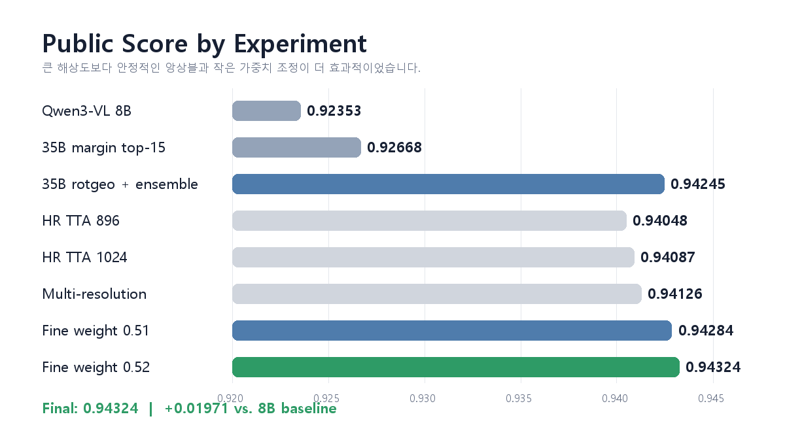

# SSAFY VLM-VQA Pipeline

**한국어** | [English](README.en.md)

재활용품 이미지와 한국어 질문, 네 개의 선택지를 입력받아 `a`~`d` 중 하나를 고르는 VQA(Visual Question Answering) 파이프라인입니다.

로컬 RTX 5060 Ti의 Qwen3-VL-4B QLoRA에서 시작해 RunPod A100의 Qwen3.5-35B-A3B, 선택지 회전 TTA, 확률 앙상블까지 확장했습니다. Public Leaderboard는 **0.92116 → 0.94324**로 개선했습니다.

> 데이터와 파생물은 공개하지 않습니다. 대회 원본 이미지/CSV, 예측 확률, 제출 CSV, LoRA adapter와 checkpoint는 이 저장소에 포함하지 않습니다. 코드는 동일한 `이미지 + question + a/b/c/d` 형식의 데이터에 맞게 수정해 사용할 수 있습니다.



## 한눈에 보기

```text
이미지 + 질문 + 선택지
        │
        ├─ Qwen3-VL 4B/8B ───────────────┐
        │   └ 4-bit QLoRA                │
        │                                ├─ 선택지별 확률 가중평균
        └─ Qwen3.5-35B-A3B ─────────────┤      │
            ├ 4-bit QLoRA, 320 steps     │      ▼
            └ choice-rotation TTA ───────┘  argmax(a,b,c,d)
                                                   │
                                      exact retrieval 보정
                                                   │
                                            submission.csv
```

여기서 모델을 “합친다”는 것은 checkpoint를 병합하는 것이 아닙니다. 모델마다 계산한 `a`, `b`, `c`, `d` 확률을 가중 평균하고 가장 높은 선택지를 고르는 **soft ensemble**입니다.

## 주요 결과

| 단계 | 핵심 변경 | Public LB |
| --- | --- | ---: |
| 소규모 파이프라인 검증 | Qwen3-VL-4B, train 180개 | 0.85777 |
| 로컬 기준 모델 | Qwen3-VL-4B QLoRA, 전체 train | 0.92116 |
| A100 기준 모델 | Qwen3-VL-8B | 0.92353 |
| Qwen3.5 기본 후보 | 35B-A3B QLoRA + rotation TTA + soft ensemble | 0.94245 |
| 896px / 1024px TTA | 고해상도 추론 | 0.94048 / 0.94087 |
| 최종 미세조정 | Qwen3.5 weight `0.50 → 0.52` | **0.94324** |

고해상도 후보의 dev accuracy는 최대 0.94882였지만 Public은 오히려 낮아졌습니다. 이 프로젝트는 성공한 방법뿐 아니라 dev 과적합, margin router 실패와 제출 횟수 관리까지 함께 기록합니다.

자세한 시간순 실험 기록은 [docs/EXPERIMENT_LOG.ko.md](docs/EXPERIMENT_LOG.ko.md), 제출 한도 회고는 [docs/SUBMISSION_RETROSPECTIVE.ko.md](docs/SUBMISSION_RETROSPECTIVE.ko.md)에서 볼 수 있습니다.

## 핵심 아이디어

### 1. 정답 한 토큰만 학습

이미지·질문·선택지·프롬프트 영역은 label에서 `-100`으로 마스킹하고 assistant의 정답 한 글자만 loss에 반영합니다. 전체 prompt를 복원하도록 학습시키는 것보다 객관식 목표에 직접 맞습니다.

### 2. 생성 대신 선택지 logits 읽기

긴 답변을 생성하고 파싱하지 않습니다. 마지막 위치에서 `a`~`d` token의 logits만 읽어 확률로 변환합니다. 파싱 실패를 없애고 앙상블에 필요한 확률을 저장할 수 있습니다.

```python
choice_logits = next_logits.index_select(-1, choice_token_ids)
probabilities = choice_logits.float().softmax(dim=-1)
prediction = "abcd"[probabilities.argmax().item()]
```

배치 추론에서는 tokenizer를 left padding으로 설정해야 합니다. right padding 상태에서 `logits[:, -1, :]`를 읽으면 짧은 sample이 padding 위치를 참조할 수 있습니다.

### 3. Choice-rotation TTA

선택지 순서를 순환 이동해 여러 번 추론한 뒤, 확률을 원래 선택지 위치로 복원해 평균합니다. 특정 위치를 선호하는 편향을 줄이는 목적입니다.

### 4. 확률 앙상블

Qwen3-VL 계열과 Qwen3.5 계열의 선택지별 확률을 섞습니다. 최종 Public 최고 후보는 Qwen3-VL 계열 약 48%, Qwen3.5 계열 약 52%였습니다.

### 5. 중복 누수를 막는 grouped validation

동일 이미지가 train과 validation에 나뉘지 않도록 SHA-256 이미지 hash 단위로 split합니다. 단일 random split의 accuracy만 보고 조합을 고르면 dev에 과적합하기 쉽습니다.

### 6. 규정 확인 후 exact retrieval

제공 train과 test의 이미지·질문이 정확히 같고 답 선택지 text가 유일하게 매핑되는 경우에만 선택적으로 보정합니다. 적용 전 반드시 해당 대회의 외부 데이터 및 train 활용 규정을 확인해야 합니다.

## 저장소 구조

```text
.
├─ README.md / README.en.md
├─ docs/
│  ├─ EXPERIMENT_LOG.ko.md / EXPERIMENT_LOG.en.md
│  ├─ METHODS.ko.md / METHODS.en.md
│  ├─ SUBMISSION_RETROSPECTIVE.ko.md
│  └─ assets/public-score-chart.png
└─ workspace/
   ├─ configs/
   │  ├─ baseline.yaml
   │  ├─ baseline_grouped.yaml
   │  └─ qwen35_35b_a3b_qlora.yaml
   ├─ src/
   │  ├─ prepare_dataset.py
   │  ├─ train_qwen3vl.py
   │  ├─ inference.py
   │  ├─ ensemble.py
   │  ├─ evaluate.py
   │  ├─ error_analysis.py
   │  └─ retrieval_override.py
   ├─ runpod/
   │  ├─ qwen35_eval.py
   │  ├─ qwen35_rotation_subset.py
   │  ├─ build_multi_hr_ensemble.py
   │  ├─ build_calibrated_hr_ensemble.py
   │  ├─ build_public_anchor_rescue.py
   │  ├─ build_fine_standard_weights.py
   │  └─ validate_candidates.py
   └─ requirements.txt
```

## 데이터 형식

프로젝트 루트에 아래 파일과 이미지 폴더가 있다고 가정합니다.

```text
train.csv: id,path,question,a,b,c,d,answer
test.csv:  id,path,question,a,b,c,d
sample_submission.csv: id,answer
train/, test/: CSV path가 가리키는 이미지
```

`dev.csv`의 pseudo-label을 사용할 수 있지만, 이 프로젝트에서는 ground truth validation과 구분합니다. 대회별 데이터 형식과 규정에 맞게 전처리 코드를 조정하세요.

## 빠른 시작

### 1. 환경 설치

Python 3.10~3.12와 CUDA GPU를 권장합니다. PyTorch는 CUDA 환경에 맞는 wheel을 먼저 설치합니다.

```bash
python -m venv .venv
source .venv/bin/activate
pip install -r workspace/requirements.txt
```

Windows PowerShell에서는 활성화 명령이 `.venv\Scripts\Activate.ps1`입니다.

### 2. 데이터 분석과 split 생성

```bash
python workspace/src/data_analysis.py --near-threshold 2
python workspace/src/prepare_dataset.py --seed 42 --val-fraction 0.1
```

다른 위치에 데이터를 두었다면 `SSAFY_DATA_ROOT`를 `train.csv`가 있는 디렉터리로 설정합니다.

### 3. Qwen3-VL baseline 학습

```bash
python workspace/src/train_qwen3vl.py \
  --config workspace/configs/baseline_grouped.yaml
```

기본 구성은 NF4 4-bit QLoRA, BF16, answer-only supervision, SDPA와 gradient checkpointing을 사용합니다.

### 4. Validation과 test 추론

```bash
python workspace/src/inference.py \
  --adapter workspace/outputs/models/EXP/best_adapter \
  --input workspace/data/manifests/val_grouped_seed42.jsonl \
  --name EXP_val

python workspace/src/evaluate.py \
  --predictions workspace/outputs/predictions/EXP_val.jsonl

python workspace/src/inference.py \
  --adapter workspace/outputs/models/EXP/best_adapter \
  --input test.csv \
  --name EXP_test \
  --submission
```

### 5. 확률 앙상블

```bash
python workspace/src/ensemble.py \
  --inputs workspace/outputs/predictions/model_a.jsonl \
           workspace/outputs/predictions/model_b.jsonl \
  --name ensemble_ab \
  --submission
```

Qwen3.5와 다중 해상도 탐색은 `workspace/runpod/`의 스크립트를 참고하세요. 각 스크립트는 `--help`에서 필요한 dev/test JSONL과 output 경로를 확인할 수 있습니다.

## 제출 파일 검증

제출 전에는 최소한 다음을 확인합니다.

- 행 수가 test와 동일한가
- 열이 정확히 `id`, `answer`인가
- 모든 answer가 `a`, `b`, `c`, `d` 중 하나인가
- ID의 집합뿐 아니라 `sample_submission.csv` 순서까지 같은가
- 비교 기준 후보와 몇 행이 달라졌는가

`workspace/runpod/validate_candidates.py`가 이 검사를 자동화합니다.

## 잘되지 않았던 실험

- dev pseudo-label 추가 학습: validation loss는 내려갔지만 Public은 0.92116 → 0.91919로 하락
- margin/top-k router: dev에서는 일부 개선됐지만 Public 0.92668
- 896px/1024px 전체 고해상도 TTA: dev 0.94685–0.94882, Public 0.94048–0.94126
- 과도한 grid search: 작은 dev 최고점을 선택하면서 Public 일반화가 나빠짐

다음 실험에서는 pHash 기반 group 3-fold OOF, 질문 유형별 reliability routing, hard-sample fine-tuning과 서로 다른 모델 계열의 앙상블을 우선하는 것이 좋습니다.

## 재현성과 제한사항

- 모델 weight, adapter, 원본 데이터와 예측 확률은 저장소에 포함하지 않습니다.
- 리더보드 수치는 당시 대회 Public split 결과이며 다른 데이터에서 재현을 보장하지 않습니다.
- Public leaderboard는 test 일부만 평가하므로 private 결과와 순위가 달라질 수 있습니다.
- 35B 모델 학습과 전체 TTA에는 A100급 GPU가 권장됩니다.
- `Qwen3.5-35B-A3B` 관련 라이브러리 호환성은 실행 시점의 Transformers/PEFT 지원 상태를 확인해야 합니다.

## 관련 기록

- [전체 실험 로그](docs/EXPERIMENT_LOG.ko.md)
- [English experiment log](docs/EXPERIMENT_LOG.en.md)
- [제출 횟수 20회 회고](docs/SUBMISSION_RETROSPECTIVE.ko.md)
- [Kaggle 결과 공유 Discussion](https://www.kaggle.com/competitions/ssafy-16-1-ai/discussion/738274)
- [Kaggle 제출 제한 회고](https://www.kaggle.com/competitions/ssafy-16-1-ai/discussion/738275)

